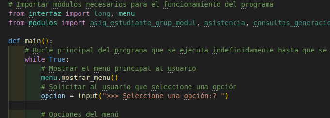

Contexto General 

ACME Education, una institución educativa dedicada a la formación técnica y profesional ha decidido modernizar su sistema de gestión de asistencia. Este sistema permitirá un control automatizado de la asistencia de sus estudiantes, facilitando la generación de informes que apoyen la mejora continua tanto de los procesos académicos como administrativos. 

Para este fin, ACME Education ha encargado el desarrollo de una solución informática llamada Sistema de Gestión de Asistencia Académica (SISGESA). Este sistema se implementará como un programa de consola, permitiendo a los usuarios interactuar con las diversas funciones a través de un menú. 

  

Descripción del Problema 

El registro manual de la asistencia de los estudiantes ha generado ineficiencias en la obtención de información fiable, afectando tanto los procesos académicos como administrativos. La solución propuesta debe automatizar este proceso, permitiendo el acceso a la información relevante y generando informes de manera clara y precisa. 

  

Objetivos del Proyecto 

Se solicita el desarrollo de un programa para la consola o terminal y escrito en el lenguaje de programación Python, que funcione como una aplicación de consola, para gestionar la asistencia académica. El sistema debe cumplir con los siguientes requisitos: 

	1. Inicio de Sesión: 

Al iniciar el programa, debe solicitarse un nombre de usuario y contraseña. La primera vez que el sistema sea ejecutado, la contraseña será la predefinida: "SISGESA". 
El sistema debe permitir cambiar esta contraseña a través de una opción en el menú. 
La contraseña debe ser guardada en un archivo y asegurada mediante algoritmos de encriptación nativos de Python, como SHA-256, sin la necesidad de instalar módulos adicionales. 

	2. Menú de Opciones: 

El programa debe presentar un menú con opciones claras para interactuar con el sistema. Las opciones del menú deben incluir: 
Registro de grupos. 
Registro de módulos. 
Registro de estudiantes. 
Registro de docentes. 
Registro de asistencia. 
Consultas de información. 
Generación de informes. 
Cambio de contraseña. 
Salida del sistema. 

   3. Registro de Grupos: El sistema debe permitir registrar grupos de estudiantes. Cada grupo debe estar identificado por un código, un nombre y una sigla. 

     4. Registro de Módulos: La institución ofrece varios módulos. El sistema debe registrar la información de cada módulo, que incluye su código, nombre y duración en semanas. 

   5. Registro de Estudiantes: El sistema debe permitir registrar estudiantes, que estarán identificados por un código, un nombre, sexo y edad. 

    6. Asignación de Estudiantes a Grupos y Módulos: Los estudiantes se asignarán a un único grupo y podrán estar matriculados en entre 1 y 3 módulos. El sistema debe permitir asociar a los estudiantes con sus respectivos grupos y módulos. 

   7. Registro de Docentes: Los docentes deben ser registrados en el sistema, identificados por su cédula y nombre. Un docente puede impartir hasta tres módulos diferentes. 

     8. Registro de Asistencia: 

El sistema debe permitir registrar la asistencia de los estudiantes. Cada estudiante marcará su asistencia utilizando un dispositivo magnético, y los datos registrados incluirán: 
Código del estudiante 
Código del módulo 
Fecha y hora de entrada 
Fecha y hora de salida 

    9. Consultas por Código: Las consultas se realizarán exclusivamente utilizando los códigos de los grupos, módulos, estudiantes y docentes, para simplificar la implementación. El sistema debe permitir: 

Consultar los estudiantes matriculados en un grupo. 
Consultar los estudiantes inscritos en un módulo. 
Consultar los docentes que imparten un módulo. 
Consultar los estudiantes a cargo de un docente en un módulo. 

     10. Informes de Asistencia: 

El sistema debe generar informes con los siguientes datos: 
Estudiantes que han llegado tarde a un módulo en un mes específico. 
Estudiantes que se retiraron antes de la finalización de una sesión en un mes específico. 
Estudiantes que no han faltado a ningún módulo durante un mes. 
Porcentaje de asistencia por módulo, calculado como la proporción de estudiantes que asistieron al inicio de clase respecto al total de estudiantes matriculados. 

     11. Persistencia de Datos: Todos los datos relacionados con estudiantes, grupos, módulos y docentes deben ser almacenados de manera persistente en archivos, de modo que al reiniciar el programa, se pueda continuar trabajando con los datos previamente registrados. 

     12. Formato de Salida: Los informes generados por el sistema deben ser legibles y estar bien formateados en la consola. El uso de tablas o listas numeradas será fundamental para garantizar la claridad de la información. 

     13. Manejo de Errores y Validación de Datos: 

El sistema debe manejar correctamente entradas inválidas tanto en el menú como en las diversas funcionalidades. Debe guiar al usuario para que ingrese opciones o datos correctos. 
El manejo de errores debe implementarse de forma robusta para asegurar que el programa no se interrumpa inesperadamente. 

     14. Cambio de Contraseña y Seguridad: 

El sistema debe permitir cambiar la contraseña del usuario a través de una opción del menú. La contraseña actualizada debe ser encriptada utilizando el algoritmo SHA-256 antes de ser almacenada en el archivo correspondiente. 
En cada nuevo inicio del programa, el sistema debe solicitar la contraseña encriptada y verificarla antes de permitir el acceso al menú principal. 

    15. Salida del Sistema: El programa debe permitir al usuario salir de manera segura, asegurándose de que toda la información se guarde correctamente antes de finalizar la ejecución. 

  

Restricciones Técnicas 

El software debe ser desarrollado utilizando exclusivamente Python, sin la instalación de módulos adicionales. 
El sistema debe estar organizado de manera modular, dividiendo las funcionalidades en diferentes módulos Python para facilitar su mantenimiento y futuras ampliaciones. 
El programa debe usar lo visto en el módulo del ciclo 2 usando el paradigma estructurado. No usar, ni definir clases y objetos 
El programa debe hacer uso de la persistencia de datos con JSON

Resultado esperado

Los campers deberán entregar los siguientes elementos: 

El código fuente del sistema, organizado y subido a un repositorio GitHub privado compartido a las cuentas que el trailer indique (el link del repositorio junto con su hash serán los entregables en la plataforma campuslands). 
Una presentación en donde presente su solución, un resumen de como realizó la solución y estrategias a usar. Dentro de la presentación debe incluir gráficos que detallen el diseño adoptado, las estructuras de datos utilizadas y las decisiones de programación tomadas, un diagrama de la arquitectura del programa, detallando los módulos y funciones principales implementados.  La presentación debe estar subida al GitHub
Tendrá tiempo de exposición de 10 minutos. 
