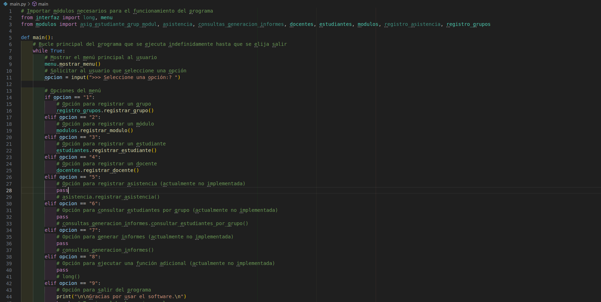

	1. Inicio de Sesión: 

El sistema deberá iniciar solicitando el nombre de usuario y contraseña. La primera vez que se ejecute, la contraseña predeterminada será "SISGESA". Utilizaremos el algoritmo SHA-256 para encriptar la contraseña y almacenarla en un archivo JSON.

Estructura del código:

1. Cargar la contraseña encriptada de un archivo JSON.

1.1 Definición de la Función:

Se define una función llamada cargar_contraseña que no toma argumentos.

1.2 Intento de Abrir el Archivo:

*Se utiliza un bloque try para manejar posibles excepciones.
*Intenta abrir un archivo llamado contraseña.json en modo de lectura ("r").
*Si el archivo se abre correctamente, se asigna a la variable archivo.

1.3 Carga de Datos JSON:

* Se carga el contenido del archivo JSON en la variable datos. Esto convierte el JSON en un objeto de Python(normalmente un diccionario).

1.4 Retorno de la contraseña:

* Retorna el valor asociado con la clave "contraseña" en el diccionario datos. Este es el valor de la contraseña que fue previamente guardada.

2. Solicitar al usuario ingresar su nombre y contraseña.

3. Comparar la contraseña ingresada con la almacenada (encriptada con SHA-256).

	2. Menú Principal:

Una vez que el usuario ha iniciado sesión, debe tener acceso al menú principal del sistema. Este menú ofrecerá las opciones de gestión de asistencia: registrar grupos, módulos, estudiantes, docentes, consultas, informes, cambio de contraseña, etc.

El menú principal permite al usuario interactuar con el sistema de manera estructurada, facilitando diversas acciones relacionadas con la gestión educativa. A través de opciones numeradas, los usuarios pueden acceder a funciones específicas, y el programa maneja entradas inválidas para mejorar la experiencia del usuario.

     Paso 3: Menú Principal
Una vez que el usuario ha iniciado sesión, debe tener acceso al menú principal del sistema. Este menú ofrecerá las opciones de gestión de asistencia: registrar grupos, módulos, estudiantes, docentes, consultas, informes, cambio de contraseña, etc.

     Paso 4: Registro de Grupos, Módulos, Estudiantes y Docentes
Cada entidad (grupos, módulos, estudiantes, docentes) tendrá su propio registro en el sistema. Estos datos se almacenarán en archivos JSON para garantizar la persistencia. Cada registro estará identificado por un código único, y se asociarán características adicionales como nombre, siglas, etc.

Este proceso será similar para los módulos, estudiantes y docentes. Cada entidad tendrá su propio archivo JSON para almacenar sus datos.

     Paso 5: Asignación de Estudiantes a Grupos y Módulos
Una vez registrados los estudiantes y los módulos, necesitamos una función que permita asignar estudiantes a sus respectivos grupos y módulos.

     Paso 6: Registro de Asistencia
El sistema debe registrar la asistencia de cada estudiante. Cada registro incluirá la hora de entrada y salida para cada módulo.

     Paso 7: Consultas y Generación de Informes
El sistema permitirá realizar consultas y generar informes, como estudiantes matriculados por grupo, docentes que imparten módulos, estudiantes que llegaron tarde, etc.

     Paso 8: Persistencia de Datos con JSON
La persistencia de datos es fundamental para este sistema. Utilizamos archivos JSON para guardar toda la información registrada (grupos, módulos, estudiantes, docentes, asistencia, etc.). Cada función que realice un cambio en los datos (registro, modificación, etc.) deberá guardar los datos actualizados en los archivos JSON correspondientes.

     Paso 9: Manejo de Errores y Validación
El manejo de errores debe ser robusto para evitar interrupciones inesperadas. Debemos asegurarnos de validar correctamente las entradas del usuario y manejar posibles excepciones, como archivos inexistentes o datos inválidos.

     Paso 10: Salida del Sistema
Cuando el usuario decida salir del sistema, es importante asegurarse de que todos los cambios se hayan guardado correctamente. Esto se logra confirmando que cada archivo JSON se haya actualizado con la última información antes de cerrar el programa.

     Resultado Final
Este sistema de gestión de asistencia se entregará con:
1. Código fuente: En Python, organizado en módulos que manejen cada funcionalidad.
2. Persistencia: Uso de archivos JSON para almacenar datos.
3. Seguridad: Encriptación de contraseñas utilizando SHA-256.
4. Menú: Un menú interactivo que permita al usuario navegar por las opciones del sistema.
5. Presentación: Se incluirá una presentación explicativa con diagramas y decisiones de diseño tomadas.