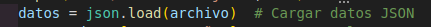
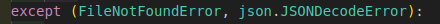
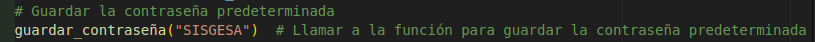
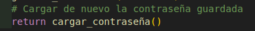

	1. Inicio de Sesión: 

El sistema deberá iniciar solicitando el nombre de usuario y contraseña. La primera vez que se ejecute, la contraseña predeterminada será "SISGESA". Utilizaremos el algoritmo SHA-256 para encriptar la contraseña y almacenarla en un archivo JSON.

Estructura del código:

1. Cargar la contraseña encriptada de un archivo JSON.
   

1.1 Definición de la Función:

Se define una función llamada cargar_contraseña que no toma argumentos.

1.2 Intento de Abrir el Archivo:

*Se utiliza un bloque try para manejar posibles excepciones.
*Intenta abrir un archivo llamado contraseña.json en modo de lectura ("r").
*Si el archivo se abre correctamente, se asigna a la variable archivo.

1.3 Carga de Datos JSON:

* Se carga el contenido del archivo JSON en la variable datos. Esto convierte el JSON en un objeto de Python(normalmente un diccionario).

1.4 Retorno de la contraseña:

* Retorna el valor asociado con la clave "contraseña" en el diccionario datos. Este es el valor de la contraseña que fue previamente guardada.

1.5 Manejo de excepciones:

* FileNotFoundError: Si el archivo contraseña.json no existe.
*json.JSONDecodeError: Si el archivo no se puede decodificar como JSON (por ejemplo, si esta vacio o tiene un formato incorrecto).

1.6 Creacion de la carpeta:

* Si se produce una excepcion, se asegura de que la carpeta data exista. La opcion exist_ok=True evita un error si la carpeta ya existe.

1.7 Guardar la contraseña predeterminada:

*Llama a la funcion guardar_contraseña y le pasa la cadena "SISGESA" como contraseña predeterminada. Esto crea el archivo con una contraseña inicial si no existe.

1.8 Cargar de nuevo la contraseña:

*Luego, la funcion llama a si misma para intentar cargar la contraseña nuevamente. Esto se hace para retornar la nueva contraseña que se acaba de guardar.

La función cargar_contraseña() es esencial para gestionar el almacenamiento y recuperación de la contraseña del sistema. Proporciona una forma robusta de asegurar que siempre haya una contraseña disponible, creando y guardando una si es necesario. Esto mejora la experiencia del usuario, ya que no tienen que preocuparse por la falta de configuración inicial.

2. Solicitar al usuario ingresar su nombre y contraseña.

2.1 Inicio del Bucle:

*Este bucle infinito permite que el usuario intente iniciar sesión varias veces. Limpia la pantalla para una mejor visualización en cada intento.

2.2 Mostrar Mensaje de Inicio:

* Imprime un encabezado que indica que es la sección de inicio de sesión. Se utiliza para dar una bienvenida visual al usuario.

2.3 Ingreso del Usuario:

* Solicita al usuario que ingrese su nombre de usuario. strip() elimina espacios en blanco al principio y al final.

2.4 Validación del Usuario:

* Verifica si el nombre de usuario contiene números. Si los hay, muestra un mensaje de error y permite volver a intentar.

2.5 Ingreso de Contraseña:

* Este bucle permite que el usuario ingrese la contraseña. Carga la contraseña guardada antes de solicitarla.

3. Comparar la contraseña ingresada con la almacenada (encriptada con SHA-256).

3.1 Comparación de Contraseña:

Este fragmento verifica si la contraseña ingresada (tras ser encriptada) coincide con la que está guardada. Si son iguales, el usuario tiene acceso.

3.2 Acceso Concedido e Interacción con el Usuario:

Pausa el programa para que el usuario pueda leer el mensaje de bienvenida y presionar "Enter" para continuar.

3.3  Salir de la Función:

La instrucción return termina la ejecución de la función iniciar_sesion. Esto permite que el programa regrese al punto donde se llamó a la función, ahora mostrando el menú principal.

3.4 Contraseña Incorrecta:

Si la contraseña ingresada no coincide con la guardada, se imprime un mensaje de error indicando que la contraseña es incorrecta.

3.5 Esperar Nuevo Intento:

Similar al paso 3, este comando pausa el programa y espera que el usuario presione "Enter" antes de permitir un nuevo intento de inicio de sesión.

	2. Menú Principal:

Una vez que el usuario ha iniciado sesión, debe tener acceso al menú principal del sistema. Este menú ofrecerá las opciones de gestión de asistencia: registrar grupos, módulos, estudiantes, docentes, consultas, informes, cambio de contraseña, etc.

El menú principal permite al usuario interactuar con el sistema de manera estructurada, facilitando diversas acciones relacionadas con la gestión educativa. A través de opciones numeradas, los usuarios pueden acceder a funciones específicas, y el programa maneja entradas inválidas para mejorar la experiencia del usuario.

     Paso 3: Registro de Grupos, Módulos, Estudiantes y Docentes
Cada entidad (grupos, módulos, estudiantes, docentes) tendrá su propio registro en el sistema. Estos datos se almacenarán en archivos JSON para garantizar la persistencia. Cada registro estará identificado por un código único, y se asociarán características adicionales como nombre, siglas, etc.

Este proceso será similar para los módulos, estudiantes y docentes. Cada entidad tendrá su propio archivo JSON para almacenar sus datos.

     Paso 4: Asignación de Estudiantes a Grupos y Módulos
Una vez registrados los estudiantes y los módulos, necesitamos una función que permita asignar estudiantes a sus respectivos grupos y módulos.

     Paso 5: Persistencia de Datos con JSON
La persistencia de datos es fundamental para este sistema. Utilizamos archivos JSON para guardar toda la información registrada (grupos, módulos, estudiantes, docentes, asistencia, etc.). Cada función que realice un cambio en los datos (registro, modificación, etc.) deberá guardar los datos actualizados en los archivos JSON correspondientes.

     Paso 6: Manejo de Errores y Validación
El manejo de errores debe ser robusto para evitar interrupciones inesperadas. Debemos asegurarnos de validar correctamente las entradas del usuario y manejar posibles excepciones, como archivos inexistentes o datos inválidos.

     Paso 7: Salida del Sistema
Cuando el usuario decida salir del sistema, es importante asegurarse de que todos los cambios se hayan guardado correctamente. Esto se logra confirmando que cada archivo JSON se haya actualizado con la última información antes de cerrar el programa.

     Resultado Final
Este sistema de gestión de asistencia se entregará con:
1. Código fuente: En Python, organizado en módulos que manejen cada funcionalidad.
2. Persistencia: Uso de archivos JSON para almacenar datos.
3. Seguridad: Encriptación de contraseñas utilizando SHA-256.
4. Menú: Un menú interactivo que permita al usuario navegar por las opciones del sistema.
5. Presentación: Se incluirá una presentación explicativa con diagramas y decisiones de diseño tomadas.